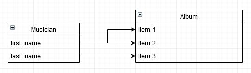

# Day24_homeworkshop

## homework

```
https://www.erdcloud.com/
에서 모델링 그리기 가능
```

1. ____(a)____는 데이터 모델링 분야에서 구조화된 데이터에 대한 일련의 표현을 위해 그
   리는 도표이다. 소프트웨어(시스템)를 작성하는 과정에서 반드시 작성하게 되는 도표로
   데이터베이스의 구조를 나타낸다. 빈칸 (a)에 들어갈 용어를 작성하시오.

```
ERD = Entity Relationship modeling - 개체 관계 모델링
```

2. 다양한 표기법이 사용되지만, 위의 도표에서 활용된 표기법은 무엇인가?

   ```
   Entity Relationship Diagram
   ```

3. 위의 도표는 어떠한 관계를 나타내는가?

```
게시글과 댓글이
1 : N의 관계를 나타내는 것을 의미한다.
```

## workshop

아래의 Django 코드를 바탕으로 개체 관계 다이어그램 (ERD) 을 작성하시오.

Musician : Album = 1: N

```
https://www.draw.io/
에서 작성
```



